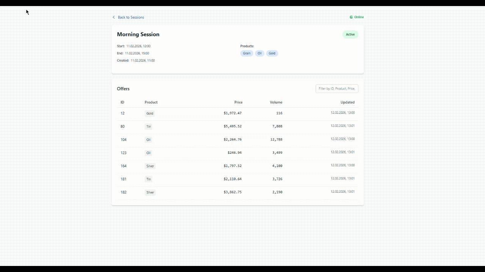

# Real-Time Trading Dashboard

> A high-performance, real-time trading dashboard built with modern web technologies, demonstrating expertise in reactive programming, state management, and WebSocket communication.



## 🎯 Overview

A real-time trading dashboard application that displays and updates trading offers in real-time. The application showcases advanced Angular patterns, reactive state management with NgRx, and seamless WebSocket integration using SignalR.

## ✨ Key Features

- **Real-Time Updates**: Live trading offer updates via WebSocket (SignalR) with automatic reconnection
- **Reactive State Management**: NgRx with Entity Adapter for efficient state handling
- **Advanced Angular Patterns**: Standalone components, signals, effects, and OnPush change detection
- **Server-Side Rendering (SSR)**: Angular Universal for improved SEO and initial load performance
- **Price Change Indicators**: Visual feedback for price movements with smooth animations
- **Filtering & Sorting**: Client-side filtering and multi-column sorting
- **Connection Status**: Real-time WebSocket connection monitoring
- **Error Handling**: Robust error handling with user-friendly messages

## 🛠️ Technology Stack

### Frontend
- **Angular 21** - Latest Angular with standalone components
- **TypeScript 5.9** - Type-safe development
- **NgRx 21** - State management with Store, Effects, Entity, Router Store
- **RxJS 7.8** - Reactive programming
- **SignalR** - Real-time WebSocket communication
- **Tailwind CSS 4** - Utility-first CSS framework
- **Angular SSR** - Server-side rendering

### Backend
- **ASP.NET Core 8.0** - Modern .NET web framework
- **SignalR** - Real-time bidirectional communication
- **Background Services** - Continuous offer generation simulation

## 🏗️ Architecture Highlights

### Frontend Architecture

- **Standalone Components**: Modern Angular approach without NgModules
- **Signal-Based Reactivity**: Using Angular signals for reactive state
- **NgRx Effects**: Side effects management for API calls and WebSocket events
- **Entity Adapter**: Efficient CRUD operations on normalized state
- **OnPush Change Detection**: Optimized rendering performance
- **Effect API**: Reactive side effects with proper cleanup

### State Management

```typescript
// NgRx Store with Entity Adapter
- TradingSession Entity State
- Selectors for computed values
- Effects for async operations
- Actions for state mutations
```

### WebSocket Integration

- **Automatic Reconnection**: Exponential backoff strategy
- **Connection State Management**: Real-time status tracking
- **Event-Driven Updates**: Reactive event handling
- **Batch Updates**: Efficient handling of multiple offer changes

### Backend Architecture

- **RESTful API**: Clean API design with proper HTTP methods
- **SignalR Hub**: Real-time communication endpoint
- **Background Service**: Simulated trading activity
- **Dependency Injection**: Proper service registration and lifecycle management

## 🚀 Getting Started

### Prerequisites

- Node.js 18+ and npm 11.6.2+
- .NET 8.0 SDK
- Angular CLI 21+

### Installation

1. **Clone the repository**
   ```bash
   git clone https://github.com/DronDima/real-time-trading-dashboard.git
   cd real-time-trading-dashboard
   ```

2. **Install frontend dependencies**
   ```bash
   npm install
   ```

3. **Run the backend API**
   ```bash
   cd api
   dotnet run
   ```
   The API will be available at `http://localhost:5160`

4. **Run the frontend application**
   ```bash
   npm start
   ```
   The application will be available at `http://localhost:4200`


## 📁 Project Structure

```
real-time-trading-dashboard/
├── api/                          # ASP.NET Core backend
│   ├── Controllers/              # REST API controllers
│   ├── Hubs/                     # SignalR hubs
│   ├── Services/                 # Business logic services
│   ├── Models/                   # Data models
│   └── Program.cs                # Application entry point
├── src/
│   └── app/
│       ├── components/           # Feature components
│       │   ├── home/             # Home page with session list
│       │   └── trading-session/  # Trading session detail page
│       ├── store/                # NgRx store
│       │   └── trading-session/  # Feature store module
│       ├── services/             # Angular services
│       ├── models/               # TypeScript models
│       └── utils/                # Utility functions
└── README.md
```

## 🎨 Key Implementation Details

### Reactive State Management

The application uses NgRx for predictable state management:

- **Entity Adapter**: Normalized state structure for efficient updates
- **Selectors**: Memoized selectors for computed values
- **Effects**: Side effects for API calls and WebSocket events
- **Router Integration**: NgRx Router Store for route-based state

### Real-Time Updates

WebSocket integration with SignalR:

- **Automatic Reconnection**: Exponential backoff with configurable max attempts
- **Connection State**: Real-time status tracking in the UI
- **Event Handling**: Reactive event processing with RxJS
- **Batch Processing**: Efficient handling of multiple simultaneous updates

### Performance Optimizations

- **OnPush Change Detection**: Minimizes unnecessary change detection cycles
- **Computed Signals**: Efficient derived state calculations
- **Memoized Selectors**: NgRx selectors prevent unnecessary recalculations
- **Lazy Loading**: Route-based code splitting

### Modern Angular Patterns

- **Standalone Components**: No NgModules, cleaner dependency management
- **Signals**: Reactive primitives for state management
- **Effects API**: Declarative side effects with automatic cleanup
- **Inject Function**: Modern dependency injection approach
- **DestroyRef**: Proper cleanup without lifecycle hooks


## 📊 Features in Detail

### Trading Session Management

- View multiple trading sessions
- Navigate to session details
- Real-time session status updates
- Session filtering and search

### Offer Management

- Real-time offer creation, updates, and deletion
- Price change indicators (up/down arrows)
- Volume display with formatting
- Multi-column sorting
- Text-based filtering

### Connection Management

- Visual connection status indicator
- Automatic reconnection on disconnect
- Connection state in NgRx store
- User-friendly error messages


## 📝 Code Quality

- **TypeScript**: Strict type checking enabled
- **ESLint**: Code linting (if configured)
- **Prettier**: Code formatting with Angular-specific rules
- **Angular Style Guide**: Following Angular best practices


## 🤝 Contributing

Contributions are welcome! Please feel free to submit a Pull Request.

## 📄 License

This project is licensed under the MIT License.

## 👨‍💻 Author

Built with ❤️ demonstrating expertise in:
- Modern Angular development
- Reactive programming patterns
- Real-time web applications
- State management best practices
- Full-stack development

---

**Note**: This project demonstrates advanced Angular and .NET development patterns suitable for production-grade applications.
